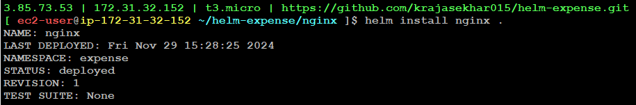
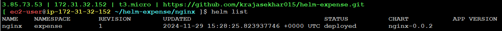

# HELM CHARTS

Helm Charts are a way to define, install, and manage Kubernetes applications. **Helm is a package manager for Kubernetes, and Helm Charts are the "packages" that Helm uses to deploy applications or services onto a Kubernetes cluster.**

Generally we have two steps for docker and kubernetes. They are: 
1. image creation -> Dockerfile 
2. How to run image -> Docker compose/manifest

First thing here that image should exist physically. If image exits, then we can tell kubernetes how to run the image with different options like deployment, statefulset, pod, replicaset, how many number of replicas required, how many resources etc., through manifest file. 

- Polpular tools have opensource images and also opensource manifest

**Usage of Helm Charts**
- We can use helm charts to templatise manifest files 
- To install custom or popular applications in kubernetes like CSI drivers, Metrics Server, Prometherus/Grafana 

**Installing Helm**
- Go to the official website
```
https://helm.sh/docs/intro/install/
```
- Copy and Run the below commands. **It should be run outside of any git repository.**
```
curl -fsSL -o get_helm.sh https://raw.githubusercontent.com/helm/helm/main/scripts/get-helm-3
```
```
chmod 700 get_helm.sh
```
```
./get_helm.sh
```
- To check the version of helm
```
helm version
```

**Concept**
**1. Chart.yaml**
- The first important file we should write in helm charts is `Chart.yaml` (Here, C should be in capital)
- We need to mention what ever information we required.
**2.values.yaml**
- Then we need to write values
**3.templates/**
- It contains the information about what are the resources we are going to create
    - Deployment
    - Service

- Here, in deployment frequently changing values should be mentioned in the values.yaml and should be referred as shown below syntax.
```
image: nginx:{{ .Values.deployment.imageVersion }}
```
- In values.yaml, the syntax we need to follow as
```
deployment:
  imageVersion: latest
  replicas: 2
```

* To install any helm chart, the command is:
```
helm install <chart-name> .
```
- Here, `.` represents there is Chart.yaml in current folder



- We can list helm using the command
```
helm list
```


- Suppose, if we change the version or else no. of replicas, then we can upgrade helm using the command
```
helm upgrade nginx .
```


